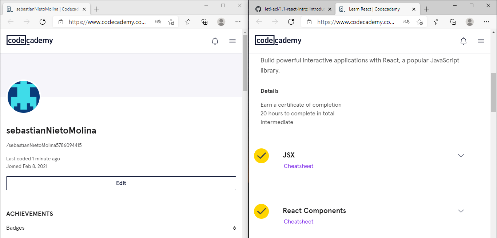
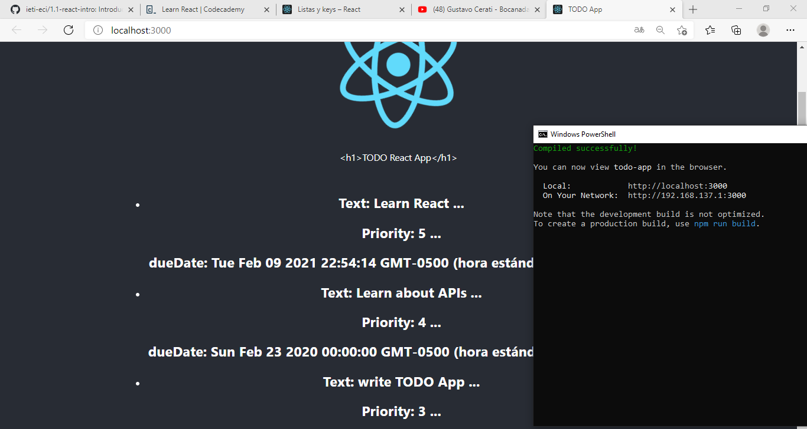
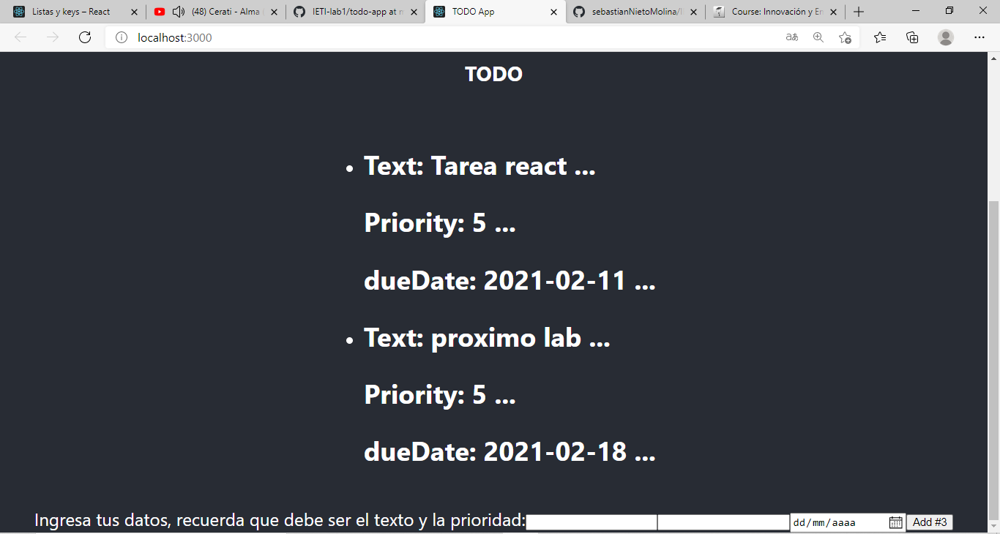
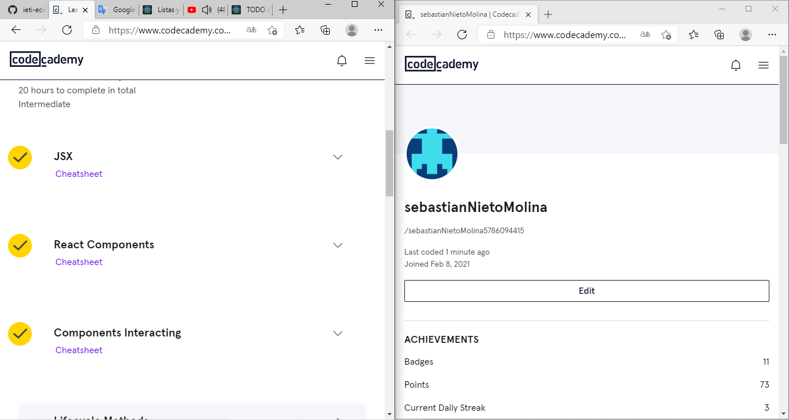

# Intro to ReactJS

Este laboratorio tiene como finalidad introducirnos a los conceptos clave para manejar ReactJS, principalmente hacemos manejo de los componentes, manejo de props y map por ejemplo.

## Comenzando 🚀

_Estas instrucciones te permitirán obtener una copia del proyecto en funcionamiento en tu máquina local para propósitos de desarrollo y pruebas._

### Pre-requisitos 📋

Para poder hacer uso de este proyecto se debe tener instalado:
 
  * NodeJs
  * Git

### Instalación 🔧

Lo primero que debe hacer es descargar el proyecto, lo pude hacer directamente descargando el .zip, o puede clonar el archivo con el siguiente comando.

```
git clone https://github.com/sebastianNietoMolina/IETI-lab1.git
```

Entramos al directorio del proyecto con el comando

```
cd todo-app
```

Ejecutamos los siguientes comandos para poder ver el proyecto, en particular, como el ultimo commit que se hizo fue del tercer punto, vean el formulario para subir los datos. Esto puede tardar varios minutos, cuando ejecute el segundo comando se abrirá una ventana y podrá interactuar con la aplicación.

```
npm install
npm start
```

## Parte 1

Para esta primera parte nos pedía crear una aplicación básica react, en particular tuve el problema de que el comando que mostrare a continuación no me permitía ejecutar.

```
npx create-react-app todo-app
```
Para resolver este problema encontré en internet la siguiente solución, anexo la página [aquí](https://github.com/facebook/create-react-app/issues/9091), Al cual pude resolver usando el siguiente comando.

```
npm install -g create-react-app
```

Principalmente se adjunta la imagen de los primeros 2 módulos pedidos (JSX and React Components) 


## Part 2

Esta segunda parte requería que aprendiéramos a manejar los componentes de tal forma que pudiéramos comunicarnos en diferentes archivos js. 


## Parte 3

Esta ultima parte ya nos pedía interactuar más con los componentes, además del tercer modulo del curso anteriormente mencionado.



## Autores ✒️

* **Sebastian Nieto** - [sebastianNieto](https://github.com/sebastianNietoMolina)

## Licencia 📄

Este proyecto está bajo la Licencia MIT - mira el archivo [LICENSE.md](todo-app/LICENSE.md) para detalles

## Expresiones de Gratitud 🎁

Reconocimientos a: [Villanuevand](https://github.com/Villanuevand), use su plantilla de README.md.
